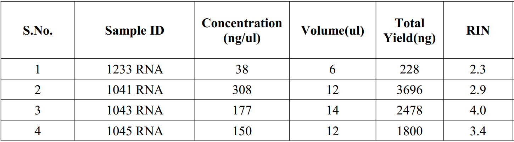

# redcliffe

```R
setwd(readClipboard())
```

## RIN Values


In order to generate library inserts of an appropriate size for compatibility with Illumina sequencing, RNA molecules obtained from high-quality or partially degraded samples must be fragmented prior to cDNA synthesis. For highly degraded, low-quality starting material, the RNA fragmentation step should be skipped. Please refer to Option 2 for Protocol A (Section V.A) for guidance on how to proceed if you are skipping the fragmentation step.
<br>

<br>

SMARTer Stranded Total RNA-Seq Kit v2 - Pico Input Mammalian protocol overview.<br>
This kit features an easy workflow that generates Illumina-compatible RNA-seq libraries in approximately 6 hr. First, total RNA is converted to cDNA (Protocol A), and then adapters for Illumina sequencing (with specific barcodes) are added through PCR using only a limited number of cycles (Protocol B). The PCR products are purified (Protocol C), and then ribosomal cDNA is depleted (Protocol D). The cDNA fragments from Protocol D are further amplified (Protocol E) with primers universal to all libraries. Lastly, the PCR products are purified once more to yield the final cDNA library (Protocol F). Actual processing time may vary depending on the number of samples and cycling conditions (e.g., Protocol E takes more than 30 min if using 16 cycles of PCR or if using a thermal cycler with a slow ramping time), but a set of 24–48 samples can be easily processed from A through F within an 8-hr working day. As outlined in Section V, the kit workflow includes three safe stopping points following the completion of Protocols A, B, and E, respectively


Schematic of technology in the SMARTer Stranded Total RNA-Seq Kit v2 - Pico Input Mammalian.<br> SMART technology
is used in this ligation-free protocol to preserve strand-of-origin information. Random priming (represented by the green N6 Primer) allows
the generation of cDNA from all RNA fragments in the sample, including rRNA. When the SMARTScribe™ Reverse Transcriptase (RT)
reaches the 5’ end of the RNA fragment, the enzyme’s terminal transferase activity adds a few nontemplated nucleotides to the 3’ end of
the cDNA (shown as Xs). The carefully designed Pico v2 SMART Adapter (included in the SMART TSO Mix v2) base-pairs with the
nontemplated nucleotide stretch, creating an extended template to enable the RT to continue replicating to the end of the oligonucleotide.
The resulting cDNA contains sequences derived from the random primer and the Pico v2 SMART Adapter used in the reverse transcription
reaction. In the next step, a first round of PCR amplification (PCR 1) adds full-length Illumina adapters, including barcodes. The 5’ PCR
Primer binds to the Pico v2 SMART Adapter sequence (light purple), while the 3’ PCR Primer binds to sequence associated with the
random primer (green). The ribosomal cDNA (originating from rRNA) is then cleaved by ZapR v2 in the presence of the mammalianspecific R-Probes. This process leaves the library fragments originating from non-rRNA molecules untouched, with priming sites available
on both 5’ and 3’ ends for further PCR amplification. These fragments are enriched via a second round of PCR amplification (PCR 2) using
primers universal to all libraries. The final library contains sequences allowing clustering on any Illumina flow cell

## DESeq2 analysis


```R
options(warn=-1)
library(DESeq2)
library(apeglm)
library(ggplot2) # for making plots
library(magrittr)
library(EnhancedVolcano)
library(repr)
```


```R
#Load the readcount matrix
setwd(readClipboard()) #D:\OneDrive - St John's National Academy of Health Sciences\Documents\Shared Folder\Snijesh\DataAnalysis\redcliffelabs\myanalysis\
readcounts <- read.table("counts_final.txt", header=TRUE, row.names = 1)
head(readcounts)
dim(readcounts)
```


<table class="dataframe">
<caption>A data.frame: 6 × 4</caption>
<thead>
	<tr><th></th><th scope=col>A1233_Aligned.sortedByCoord.out.bam</th><th scope=col>B_1041_Aligned.sortedByCoord.out.bam</th><th scope=col>C1043_Aligned.sortedByCoord.out.bam</th><th scope=col>D_1045_Aligned.sortedByCoord.out.bam</th></tr>
	<tr><th></th><th scope=col>&lt;int&gt;</th><th scope=col>&lt;int&gt;</th><th scope=col>&lt;int&gt;</th><th scope=col>&lt;int&gt;</th></tr>
</thead>
<tbody>
	<tr><th scope=row>ENSG00000223972</th><td>0</td><td>0</td><td> 0</td><td> 0</td></tr>
	<tr><th scope=row>ENSG00000227232</th><td>1</td><td>3</td><td>17</td><td>17</td></tr>
	<tr><th scope=row>ENSG00000278267</th><td>1</td><td>0</td><td>10</td><td> 0</td></tr>
	<tr><th scope=row>ENSG00000243485</th><td>0</td><td>0</td><td> 0</td><td> 0</td></tr>
	<tr><th scope=row>ENSG00000284332</th><td>0</td><td>0</td><td> 0</td><td> 0</td></tr>
	<tr><th scope=row>ENSG00000237613</th><td>0</td><td>0</td><td> 0</td><td> 0</td></tr>
</tbody>
</table>


<ol class=list-inline><li>60676</li><li>4</li></ol>


```R
#standardize the names by removing the unwanted strings in the sample name
names(readcounts) = gsub(pattern = "_Aligned.sortedByCoord.out.bam*", replacement = "", x = names(readcounts))
head(readcounts, 4)
```


<table class="dataframe">
<caption>A data.frame: 4 × 4</caption>
<thead>
	<tr><th></th><th scope=col>A1233</th><th scope=col>B_1041</th><th scope=col>C1043</th><th scope=col>D_1045</th></tr>
	<tr><th></th><th scope=col>&lt;int&gt;</th><th scope=col>&lt;int&gt;</th><th scope=col>&lt;int&gt;</th><th scope=col>&lt;int&gt;</th></tr>
</thead>
<tbody>
	<tr><th scope=row>ENSG00000223972</th><td>0</td><td>0</td><td> 0</td><td> 0</td></tr>
	<tr><th scope=row>ENSG00000227232</th><td>1</td><td>3</td><td>17</td><td>17</td></tr>
	<tr><th scope=row>ENSG00000278267</th><td>1</td><td>0</td><td>10</td><td> 0</td></tr>
	<tr><th scope=row>ENSG00000243485</th><td>0</td><td>0</td><td> 0</td><td> 0</td></tr>
</tbody>
</table>


```R
#converting 'NA' values to 0 if any present
readcounts[is.na(readcounts)] <- 0
```


```R
#load the sample details
sample_info <- read.table("targets.txt", header = TRUE)
head(sample_info)
```


<table class="dataframe">
<caption>A data.frame: 4 × 2</caption>
<thead>
	<tr><th></th><th scope=col>Sample</th><th scope=col>Group</th></tr>
	<tr><th></th><th scope=col>&lt;chr&gt;</th><th scope=col>&lt;chr&gt;</th></tr>
</thead>
<tbody>
	<tr><th scope=row>1</th><td>A1233 </td><td>Treated</td></tr>
	<tr><th scope=row>2</th><td>B_1041</td><td>Control</td></tr>
	<tr><th scope=row>3</th><td>C1043 </td><td>Treated</td></tr>
	<tr><th scope=row>4</th><td>D_1045</td><td>Control</td></tr>
</tbody>
</table>


```R
dds <- DESeqDataSetFromMatrix(countData = readcounts,
                              colData = sample_info,
                              design = ~ Group)
```


```R
#Remove genes with no reads.
dim(dds) #check dimension before removal of 0 counts
#remove genes with 0 counts
keep_genes <- rowSums(counts(dds)) > 0
dds <- dds[ keep_genes, ]
dim(dds) ##check dimension after removal of 0 counts
```


<ol class=list-inline><li>60676</li><li>4</li></ol>


<ol class=list-inline><li>35164</li><li>4</li></ol>


```R
#colSums(counts(DESeq.ds))
options(repr.plot.width = 6, repr.plot.height = 6, repr.plot.res = 150) #plot dimension
colSums(counts(dds)) %>% barplot(las=2, col = 'blue')
```


    

    


```R
colSums(counts(dds))
```


</style><dl class=dl-inline><dt>A1233</dt><dd>1283807</dd><dt>B_1041</dt><dd>1189008</dd><dt>C1043</dt><dd>7209779</dd><dt>D_1045</dt><dd>6156785</dd></dl>


```R
ds <- DESeq(dds)
```

    estimating size factors
    
    estimating dispersions
    
    gene-wise dispersion estimates
    
    mean-dispersion relationship
    
    final dispersion estimates
    
    fitting model and testing
    
    


```R
# Plot Dispersions:
png("dispersion_plot.png", units="in", width=7, height=7, res=300)
plotDispEsts(ds, main="Dispersion plot")
dev.off()
options(repr.plot.width = 8, repr.plot.height = 8, repr.plot.res = 150) #plot dimension
plotDispEsts(ds, main="Dispersion plot")
```


    

    


```R
#export normalized count
norm.cts <- counts(ds, normalized=TRUE)
write.table(norm.cts, "normalized_counts.txt", sep = '\t')
```


```R
#perform vst log transformation (blind false)
vst <- vst(ds, blind=FALSE)
write.table(assay(vst), "vst_counts.txt", sep = '\t')
```


```R
# plot pca
png("pca_plots.png", units="in", width=7, height=7, res=300)
plotPCA(vst, intgroup="Group")
dev.off()
options(repr.plot.width = 8, repr.plot.height = 8, repr.plot.res = 150) #plot dimension
plotPCA(vst, intgroup="Group")
```


    

    


```R
#Differential expression analysis
res <- results(ds)
write.table(res, "treated_vs_controls.txt", sep='\t')
```


```R
# create the volcano plot
options(repr.plot.width = 8, repr.plot.height = 8, repr.plot.res = 150) #plot dimension
EnhancedVolcano(res,
                lab = rownames(res),
                x = 'log2FoldChange',
                y = 'pvalue',
                title = 'Trated versus Control',
                pCutoff = 0.01,
                FCcutoff = 1,
                pointSize = 3.0,
                labSize = 6.0)
```


    

    


```R
res1 = read.table("res.txt", header = T, row.names = 1) #added gene names to the file res
EnhancedVolcano(res1,
                lab = rownames(res1),
                x = 'log2FoldChange',
                y = 'pvalue',
                title = 'Trated versus Control',
                pCutoff = 0.01,
                FCcutoff = 1,
                pointSize = 3.0,
                labSize = 6.0)
```


    

    


```R

```


```R

```

## Comparison of qpcr data with RNASeq


```R
options(warn=-1)
library(RColorBrewer)
library(pheatmap)
library(ggpubr)
library(dplyr)
```


```R
setwd(readClipboard()) #D:\OneDrive - St John's National Academy of Health Sciences\Documents\Shared Folder\Snijesh\DataAnalysis\redcliffelabs\myanalysis
```


```R
# import qpcr data
qpcr = read.table('heatmap/qpcr.txt', sep='\t', header=T, row.names = 1)
head(qpcr, 5)
dim(qpcr)
```


<table class="dataframe">
<caption>A data.frame: 5 × 4</caption>
<thead>
	<tr><th></th><th scope=col>X1233</th><th scope=col>X1043</th><th scope=col>X1041</th><th scope=col>X1045</th></tr>
	<tr><th></th><th scope=col>&lt;dbl&gt;</th><th scope=col>&lt;dbl&gt;</th><th scope=col>&lt;dbl&gt;</th><th scope=col>&lt;dbl&gt;</th></tr>
</thead>
<tbody>
	<tr><th scope=row>ESR1</th><td>14.25</td><td>13.27</td><td> 1.51</td><td> 7.53</td></tr>
	<tr><th scope=row>PGR</th><td> 8.89</td><td> 7.78</td><td> 4.44</td><td> 9.00</td></tr>
	<tr><th scope=row>ERBB2</th><td>13.57</td><td>10.12</td><td>12.48</td><td>12.07</td></tr>
	<tr><th scope=row>GATA3</th><td>15.14</td><td>14.37</td><td> 9.79</td><td> 7.13</td></tr>
	<tr><th scope=row>TFF1</th><td>13.79</td><td>12.67</td><td> 1.51</td><td> 4.68</td></tr>
</tbody>
</table>


<ol class=list-inline><li>61</li><li>4</li></ol>


```R
#creating group to divide
group_df = data.frame(Groups=rep(c("HR+", "TNBC"),
                                 c(2,2)))
rownames(group_df) <- colnames(qpcr)
```


```R
options(repr.plot.width = 6, repr.plot.height = 10, repr.plot.res = 150)
p<-pheatmap(qpcr,
         cluster_cols = FALSE, scale = 'row',
         annotation_col = group_df,
         show_colnames = TRUE,
         colorRampPalette(c("#FF00FF", "white", "navy"))(75),
         gaps_col = cumsum(c(2,2)))

# png(file="heatmap/qpcr.png", width=6, height=10, units="in", res=300)
# p
# dev.off()
```


    

    


```R
# import rnaseq data
rnasq = read.table('heatmap/rnaseq_normalized.txt', sep='\t', header=T, row.names = 1)
head(rnasq, 5)
dim(rnasq)
```


<table class="dataframe">
<caption>A data.frame: 5 × 4</caption>
<thead>
	<tr><th></th><th scope=col>A1233</th><th scope=col>C1043</th><th scope=col>B_1041</th><th scope=col>D_1045</th></tr>
	<tr><th></th><th scope=col>&lt;dbl&gt;</th><th scope=col>&lt;dbl&gt;</th><th scope=col>&lt;dbl&gt;</th><th scope=col>&lt;dbl&gt;</th></tr>
</thead>
<tbody>
	<tr><th scope=row>CYP4Z1</th><td>1053.6473</td><td>  1.54794</td><td>   0.00000</td><td>   0.00000</td></tr>
	<tr><th scope=row>CENPF</th><td> 368.3103</td><td>124.22218</td><td>2084.14201</td><td>1784.37312</td></tr>
	<tr><th scope=row>ZEB2</th><td> 275.0672</td><td>304.94417</td><td> 187.25663</td><td> 102.99475</td></tr>
	<tr><th scope=row>ITGB6</th><td> 349.6617</td><td> 27.86292</td><td>  68.09332</td><td>  30.85497</td></tr>
	<tr><th scope=row>BMPR2</th><td> 480.2021</td><td>394.33770</td><td> 542.31467</td><td> 620.14137</td></tr>
</tbody>
</table>


<ol class=list-inline><li>56</li><li>4</li></ol>


```R
#creating group to divide
group_df = data.frame(Groups=rep(c("HR+", "TNBC"),
                                 c(2,2)))
rownames(group_df) <- colnames(rnasq)
```


```R
options(repr.plot.width = 6, repr.plot.height = 10, repr.plot.res = 150) #plot dimension
q<-pheatmap(rnasq,
         cluster_cols = FALSE, scale = 'row',
         annotation_col = group_df,
         show_colnames = TRUE,
         colorRampPalette(c("#FF00FF", "white", "navy"))(75),
         gaps_col = cumsum(c(2,2)))

# png(file="heatmap/rnaseq.png", width=6, height=10, units="in", res=300)
# q
# dev.off()
```


    

    


```R

```


```R
# vs = read.table('heatmap/rnaseq_vst.txt', sep='\t', header=T, row.names = 1)
# head(vs, 5)
# dim(vs)
# rownames(group_df) <- colnames(vs)
# r<-pheatmap(vs,
#          cluster_cols = FALSE, scale = 'row',
#          annotation_col = group_df,
#          show_colnames = FALSE,
#          colorRampPalette(c("#FF00FF", "white", "navy"))(75),
#          gaps_col = cumsum(c(2,2)))
```


```R
# merging the plots together
plot_list=list()
plot_list[['p']]=p[[4]]
plot_list[['q']]=q[[4]]
```


```R
options(repr.plot.width = 9, repr.plot.height = 10, repr.plot.res = 150) #plot dimension
grid.arrange(grobs=plot_list, ncol=2)

# png(file="heatmap/qpcr_rnaseq.png", width=12, height=10, units="in", res=300)
# grid.arrange(grobs=plot_list, ncol=2)
# dev.off()
```


    

    


```R
# Selected genes from the qpcr list
genes_of_interest = c("ESR1", "PGR", "GATA3", "TFF1", "XBP1", "FOXA1", "GRB7", "FOXC1", "AR",
                      "FABP7", "KRT17", "KRT6B", "KRT5", "NR3C1", "BMPR2")
```


```R
rownames(group_df) <- colnames(rnasq)
m=pheatmap(rnasq[rownames(rnasq) %in% genes_of_interest,], scale="row",
         colorRampPalette(c("#FF00FF", "white", "navy"))(75),
         cluster_cols=FALSE, annotation_col=group_df, gaps_col = cumsum(c(2,2)))
```


    

    


```R
rownames(group_df) <- colnames(qpcr)
n = pheatmap(qpcr[rownames(qpcr) %in% genes_of_interest,], scale="row",
         colorRampPalette(c("#FF00FF", "white", "navy"))(75),
         cluster_cols=FALSE, annotation_col=group_df, gaps_col = cumsum(c(2,2)))
```


    

    


```R
plot_list2=list()
plot_list2[['n']]=n[[4]]
plot_list2[['m']]=m[[4]]
```


```R
options(repr.plot.width = 8, repr.plot.height = 6, repr.plot.res = 150) #plot dimension
grid.arrange(grobs=plot_list2, ncol=2)
# png(file="heatmap/qpcr_rnaseq_selected.png", width=12, height=10, units="in", res=300)
# grid.arrange(grobs=plot_list2, ncol=2)
# dev.off()
# first plot qpcr & second plot is rnaseq
```


    

    


```R

```


<strong>png:</strong> 2


```R

```


```R

```

## The duplication rate analysis


```R
setwd(readClipboard())#D:\OneDrive - St John's National Academy of Health Sciences\Documents\Shared Folder\Snijesh\DataAnalysis\redcliffelabs\myanalysis\dupradar\RNASeq
```


```R
library(dupRadar)
```


```R
# The call parameters: 
bamDuprm <- "A1233_Aligned.sortedByCoord.bam"    # the duplicate marked bam file
gtf <- "genes.gtf"  # the gene model
stranded <- 2       # '0' (unstranded), '1' (stranded) and '2' (reversely stranded)
paired   <- FALSE   # is the library paired end?
threads  <- 4       # number of threads to be used

# Duplication rate analysis
dm1 <- analyzeDuprates(bamDuprm,gtf,stranded,paired,threads)

bamDuprm <- "B_1041_Aligned.sortedByCoord.bam"
dm2 <- analyzeDuprates(bamDuprm,gtf,stranded,paired,threads)

bamDuprm <- "C1043_Aligned.sortedByCoord.bam"
dm3 <- analyzeDuprates(bamDuprm,gtf,stranded,paired,threads)

bamDuprm <- "D_1045_Aligned.sortedByCoord.bam"
dm4 <- analyzeDuprates(bamDuprm,gtf,stranded,paired,threads)


write.table(dm1, "a1233.txt", sep='\t')
write.table(dm2, "b1041.txt", sep='\t')
write.table(dm3, "c1043.txt", sep='\t')
write.table(dm4, "d1045.txt", sep='\t')
```


```R
a = read.table('a1233.txt', sep='\t', header = T)
b = read.table('b1041.txt', sep='\t', header = T)
c = read.table('c1043.txt', sep='\t', header = T)
d = read.table('d1045.txt', sep='\t', header = T)
```


```R
head(a,2)
head(b,2)
head(c,2)
head(d,2)
```


<table class="dataframe">
<caption>A data.frame: 2 × 14</caption>
<thead>
	<tr><th></th><th scope=col>ID</th><th scope=col>geneLength</th><th scope=col>allCountsMulti</th><th scope=col>filteredCountsMulti</th><th scope=col>dupRateMulti</th><th scope=col>dupsPerIdMulti</th><th scope=col>RPKMulti</th><th scope=col>RPKMMulti</th><th scope=col>allCounts</th><th scope=col>filteredCounts</th><th scope=col>dupRate</th><th scope=col>dupsPerId</th><th scope=col>RPK</th><th scope=col>RPKM</th></tr>
	<tr><th></th><th scope=col>&lt;chr&gt;</th><th scope=col>&lt;int&gt;</th><th scope=col>&lt;int&gt;</th><th scope=col>&lt;int&gt;</th><th scope=col>&lt;dbl&gt;</th><th scope=col>&lt;int&gt;</th><th scope=col>&lt;dbl&gt;</th><th scope=col>&lt;dbl&gt;</th><th scope=col>&lt;int&gt;</th><th scope=col>&lt;int&gt;</th><th scope=col>&lt;dbl&gt;</th><th scope=col>&lt;int&gt;</th><th scope=col>&lt;dbl&gt;</th><th scope=col>&lt;dbl&gt;</th></tr>
</thead>
<tbody>
	<tr><th scope=row>1</th><td>ENSG00000223972</td><td>1735</td><td> 0</td><td> 0</td><td>        NA</td><td>0</td><td> 0.00000</td><td>0.0000000</td><td>0</td><td>0</td><td>NA</td><td>0</td><td>0.0000000</td><td>0.000000000</td></tr>
	<tr><th scope=row>2</th><td>ENSG00000227232</td><td>1351</td><td>98</td><td>89</td><td>0.09183673</td><td>9</td><td>72.53886</td><td>0.5351263</td><td>1</td><td>1</td><td> 0</td><td>0</td><td>0.7401925</td><td>0.005460472</td></tr>
</tbody>
</table>


<table class="dataframe">
<caption>A data.frame: 2 × 14</caption>
<thead>
	<tr><th></th><th scope=col>ID</th><th scope=col>geneLength</th><th scope=col>allCountsMulti</th><th scope=col>filteredCountsMulti</th><th scope=col>dupRateMulti</th><th scope=col>dupsPerIdMulti</th><th scope=col>RPKMulti</th><th scope=col>RPKMMulti</th><th scope=col>allCounts</th><th scope=col>filteredCounts</th><th scope=col>dupRate</th><th scope=col>dupsPerId</th><th scope=col>RPK</th><th scope=col>RPKM</th></tr>
	<tr><th></th><th scope=col>&lt;chr&gt;</th><th scope=col>&lt;int&gt;</th><th scope=col>&lt;int&gt;</th><th scope=col>&lt;int&gt;</th><th scope=col>&lt;dbl&gt;</th><th scope=col>&lt;int&gt;</th><th scope=col>&lt;dbl&gt;</th><th scope=col>&lt;dbl&gt;</th><th scope=col>&lt;int&gt;</th><th scope=col>&lt;int&gt;</th><th scope=col>&lt;dbl&gt;</th><th scope=col>&lt;int&gt;</th><th scope=col>&lt;dbl&gt;</th><th scope=col>&lt;dbl&gt;</th></tr>
</thead>
<tbody>
	<tr><th scope=row>1</th><td>ENSG00000223972</td><td>1735</td><td> 0</td><td> 0</td><td>        NA</td><td>0</td><td> 0.00000</td><td>0.0000000</td><td>0</td><td>0</td><td>       NA</td><td>0</td><td>0.000000</td><td>0.00000000</td></tr>
	<tr><th scope=row>2</th><td>ENSG00000227232</td><td>1351</td><td>77</td><td>76</td><td>0.01298701</td><td>1</td><td>56.99482</td><td>0.3849885</td><td>3</td><td>2</td><td>0.3333333</td><td>1</td><td>2.220577</td><td>0.01499955</td></tr>
</tbody>
</table>


<table class="dataframe">
<caption>A data.frame: 2 × 14</caption>
<thead>
	<tr><th></th><th scope=col>ID</th><th scope=col>geneLength</th><th scope=col>allCountsMulti</th><th scope=col>filteredCountsMulti</th><th scope=col>dupRateMulti</th><th scope=col>dupsPerIdMulti</th><th scope=col>RPKMulti</th><th scope=col>RPKMMulti</th><th scope=col>allCounts</th><th scope=col>filteredCounts</th><th scope=col>dupRate</th><th scope=col>dupsPerId</th><th scope=col>RPK</th><th scope=col>RPKM</th></tr>
	<tr><th></th><th scope=col>&lt;chr&gt;</th><th scope=col>&lt;int&gt;</th><th scope=col>&lt;int&gt;</th><th scope=col>&lt;int&gt;</th><th scope=col>&lt;dbl&gt;</th><th scope=col>&lt;int&gt;</th><th scope=col>&lt;dbl&gt;</th><th scope=col>&lt;dbl&gt;</th><th scope=col>&lt;int&gt;</th><th scope=col>&lt;int&gt;</th><th scope=col>&lt;dbl&gt;</th><th scope=col>&lt;int&gt;</th><th scope=col>&lt;dbl&gt;</th><th scope=col>&lt;dbl&gt;</th></tr>
</thead>
<tbody>
	<tr><th scope=row>1</th><td>ENSG00000223972</td><td>1735</td><td>  3</td><td>  2</td><td>0.3333333</td><td> 1</td><td>  1.729107</td><td>0.03657321</td><td> 0</td><td> 0</td><td>       NA</td><td>0</td><td> 0.00000</td><td>0.0000000</td></tr>
	<tr><th scope=row>2</th><td>ENSG00000227232</td><td>1351</td><td>182</td><td>141</td><td>0.2252747</td><td>41</td><td>134.715026</td><td>2.84942558</td><td>17</td><td>10</td><td>0.4117647</td><td>7</td><td>12.58327</td><td>0.2661551</td></tr>
</tbody>
</table>


<table class="dataframe">
<caption>A data.frame: 2 × 14</caption>
<thead>
	<tr><th></th><th scope=col>ID</th><th scope=col>geneLength</th><th scope=col>allCountsMulti</th><th scope=col>filteredCountsMulti</th><th scope=col>dupRateMulti</th><th scope=col>dupsPerIdMulti</th><th scope=col>RPKMulti</th><th scope=col>RPKMMulti</th><th scope=col>allCounts</th><th scope=col>filteredCounts</th><th scope=col>dupRate</th><th scope=col>dupsPerId</th><th scope=col>RPK</th><th scope=col>RPKM</th></tr>
	<tr><th></th><th scope=col>&lt;chr&gt;</th><th scope=col>&lt;int&gt;</th><th scope=col>&lt;int&gt;</th><th scope=col>&lt;int&gt;</th><th scope=col>&lt;dbl&gt;</th><th scope=col>&lt;int&gt;</th><th scope=col>&lt;dbl&gt;</th><th scope=col>&lt;dbl&gt;</th><th scope=col>&lt;int&gt;</th><th scope=col>&lt;int&gt;</th><th scope=col>&lt;dbl&gt;</th><th scope=col>&lt;int&gt;</th><th scope=col>&lt;dbl&gt;</th><th scope=col>&lt;dbl&gt;</th></tr>
</thead>
<tbody>
	<tr><th scope=row>1</th><td>ENSG00000223972</td><td>1735</td><td>  2</td><td>  2</td><td>0.0000000</td><td> 0</td><td>  1.152738</td><td>0.03075971</td><td> 0</td><td> 0</td><td>       NA</td><td>0</td><td> 0.00000</td><td>0.0000000</td></tr>
	<tr><th scope=row>2</th><td>ENSG00000227232</td><td>1351</td><td>240</td><td>200</td><td>0.1666667</td><td>40</td><td>177.646188</td><td>4.74031921</td><td>17</td><td>11</td><td>0.3529412</td><td>6</td><td>12.58327</td><td>0.3357726</td></tr>
</tbody>
</table>


```R
options(repr.plot.width = 12, repr.plot.height = 10, repr.plot.res = 150) #plot dimension
```


```R
par(mfrow=c(2,2))
duprateExpDensPlot(DupMat=a) #duprate plot
title("A1233")

duprateExpDensPlot(DupMat=b) #duprate plot
title("B1041")

duprateExpDensPlot(DupMat=c) #duprate plot
title("C1043")

duprateExpDensPlot(DupMat=d) #duprate plot
title("D1045")
```


    

    


```R
## duprate boxplot
par(mfrow=c(2,2))
duprateExpBoxplot(DupMat=a)
title("A1233")
duprateExpBoxplot(DupMat=b)
title("B1041")
duprateExpBoxplot(DupMat=c)
title("C1043")
duprateExpBoxplot(DupMat=d)
title("D1045")
```


    

    


```R
# or, just to get the fitted model without plot
print("==Duplication Rate for A1233==")
fit <- duprateExpFit(DupMat=a)
cat("duprate at low read counts: ",fit$intercept,"\n",
    "progression of the duplication rate: ",fit$slope,fill=TRUE)

print("==Duplication Rate for B1041==")
fit <- duprateExpFit(DupMat=b)
cat("duprate at low read counts: ",fit$intercept,"\n",
    "progression of the duplication rate: ",fit$slope,fill=TRUE)

print("==Duplication Rate for C1043==")
fit <- duprateExpFit(DupMat=c)
cat("duprate at low read counts: ",fit$intercept,"\n",
    "progression of the duplication rate: ",fit$slope,fill=TRUE)

print("==Duplication Rate for D1045==")
fit <- duprateExpFit(DupMat=d)
cat("duprate at low read counts: ",fit$intercept,"\n",
    "progression of the duplication rate: ",fit$slope,fill=TRUE)
```

    [1] "==Duplication Rate for A1233=="
    duprate at low read counts:  0.1502647 
     progression of the duplication rate:  
    2.011921
    [1] "==Duplication Rate for B1041=="
    duprate at low read counts:  0.1668266 
     progression of the duplication rate:  
    1.991987
    [1] "==Duplication Rate for C1043=="
    duprate at low read counts:  0.256386 
     progression of the duplication rate:  
    1.553265
    [1] "==Duplication Rate for D1045=="
    duprate at low read counts:  0.2833686 
     progression of the duplication rate:  
    1.600861
    


```R
#percentage of reads in expressed bin
par(mfrow=c(2,2))
readcountExpBoxplot(DupMat=a)
#title("A1233")
readcountExpBoxplot(DupMat=b)
#title("B1041")
readcountExpBoxplot(DupMat=c)
# title("C1043")
readcountExpBoxplot(DupMat=d)
# title("D1045")
```


    

    


```R
# The distribution of RPK values per genes
par(mfrow=c(2,2))
expressionHist(DupMat=a)
title("A1233")
expressionHist(DupMat=b)
title("B1041")
expressionHist(DupMat=c)
title("C1043")
expressionHist(DupMat=d)
title("D1045")
```


    

    


```R

```


```R

```


```R
# ## make a duprate plot (blue cloud)
# png("A1233_B1041_duprate_plot.png", units="in", width=10, height=7, res=300)
# par(mfrow=c(1,2))
# duprateExpDensPlot(DupMat=a)       
# title("A1233")
# duprateExpDensPlot(DupMat=b)  
# title("B1041.txt")
# dev.off()
```


<strong>png:</strong> 2

